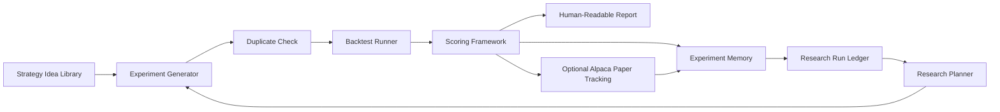

# Research System Architecture

## Summary

The system is a research lab for stock strategies. It continuously generates or
selects strategy ideas, tests variations, scores outcomes, remembers prior
experiments, and recommends the next research step. It should optimize for
learning velocity, evidence quality, and clear reporting rather than live
execution readiness.

The first version should be deliberately smaller than a full autonomous trading
desk: one local research loop, one experiment memory, one scoring framework, and
human-readable reports. Alpaca paper tracking is allowed only as an observation
layer after a strategy has already passed research criteria.

## Major Components

1. Strategy idea library
   - Maintains known strategy families: trend following, mean reversion,
     momentum, breakout, volatility, sector rotation, and risk-on/risk-off.
   - Expands each family into parameterized experiment specs.
   - Records the hypothesis being tested, not just the parameters.

2. Backtest and evaluation runner
   - Runs strategy specs against selected symbols, time periods, and datasets.
   - Captures trades, equity curve metrics, exposure, drawdown, and regime
     behavior.
   - Should support fast iteration first, then broader walk-forward checks.

3. Scoring framework
   - Converts raw metrics into an interpretable research score.
   - Uses return, drawdown, Sharpe or Sortino, win rate, profit factor, trade
     count, exposure, regime consistency, and robustness across symbols or time
     periods.
   - Produces a grade such as `reject`, `watch`, `promising`, or `candidate`.

4. Experiment memory
   - Stores each experiment as append-only JSONL.
   - Uses a deterministic fingerprint from the strategy family, rules,
     parameters, dataset, symbols, and test period.
   - Prevents repeated tests unless the record includes a clear revisit reason.
   - Keeps experiment records separate from research run records so long-term
     analysis can answer both "what did this strategy do?" and "what did this
     batch accomplish?"

5. Research planner
   - Reads recent and historical results.
   - Identifies promising families, exhausted branches, weak assumptions, and
     next experiments.
   - Prefers evidence-driven variations over random parameter churn.

6. Reporting layer
   - Produces human-readable reports after each batch.
   - Explains what was tested, what worked, what failed, what changed, and what
     should happen next.

7. Research run ledger
   - Stores one append-only record per batch or scheduled run.
   - Captures purpose, mode, status, attempted experiments, created records,
     skipped duplicates, strategy family counts, grade counts, output paths, and
     next action.
   - Is the anchor for long-term evidence that the system is learning over time.

8. Alpaca paper tracking adapter
   - Observes a research-approved strategy in a paper account or simulated paper
     ledger.
   - Does not grant live execution authority.
   - Does not replace backtesting, scoring, or human review.

## Data Flow

## Strategy Research Loop

1. Select a strategy family or revisit an existing branch with a reason.
2. Generate a small batch of variations.
3. Fingerprint each variation and skip duplicates already in memory.
4. Run tests on the selected dataset and market period.
5. Score each result using the shared criteria.
6. Save the full experiment record and conclusion.
7. Save a research run record with batch-level counts and outputs.
8. Summarize which ideas are rejected, watchlisted, promising, or candidates.
9. Choose the next batch from evidence: improve a promising branch, broaden a
   robustness check, or retire an exhausted family.

## Experiment Record

Each experiment should preserve:

- `experiment_id` and deterministic `fingerprint`
- strategy family, strategy name, hypothesis, rules, parameters, and risk model
- dataset identity, symbols, timeframe, start date, and end date
- raw metrics and normalized score
- grade, conclusion, weaknesses, and next action
- revisit policy and optional revisit reason
- timestamp and code/config version when available

The canonical storage format for v1 is append-only JSONL. SQLite can be added
after the workflow stabilizes.

## Research Run Record

Each run should preserve:

- `run_id`, timestamp, purpose, mode, and completion status
- attempted, created, and duplicate-skipped experiment counts
- strategy family counts and grade counts
- paths to the experiment log and generated report
- notes that explain the run context
- the next action chosen from the evidence

This record is what makes scheduled or GitHub Actions-based research useful over
months. Individual experiment records explain each test; run records explain the
research process.

## Scoring and Acceptance

The v1 scoring model should be transparent rather than clever. A strategy earns
points for return quality, controlled drawdown, risk-adjusted performance,
enough trades to matter, consistent behavior across symbols or periods, and
reasonable market exposure. It loses points for high drawdown, too few trades,
over-concentration, unstable regime performance, or fragile parameter behavior.

Suggested grades:

- `reject`: weak score, unacceptable drawdown, too few trades, or obvious
  overfit.
- `watch`: interesting but incomplete, unstable, or needs a better test.
- `promising`: passes basic score and risk checks, worth deeper robustness work.
- `candidate`: strong enough for walk-forward validation or paper observation.

Default thresholds and weights live in
[`configs/research_criteria.yaml`](../configs/research_criteria.yaml).

## Alpaca Paper Tracking Role

Alpaca paper tracking is a later-stage observation layer, not the research
engine. A strategy may be mirrored or tracked in paper only after it has a saved
research record with a `candidate` grade or a documented exception.

V1 should not place broker orders. The first useful integration is a paper
tracking adapter that can write intended paper signals or paper observations to
the experiment log. Actual paper order placement can be considered after the
research loop, logging, and reporting are working.

## Implementation Phases

Phase 1: Research core
- Create experiment spec, fingerprinting, scoring, and append-only logging.
- Seed common strategy families and parameter variations.
- Include a small local backtest core for the first simple strategies.
- Add a research run ledger so every batch has a durable summary.
- Produce reports from saved experiment records.

Phase 2: Backtest integration
- Add a backtest runner using a proven Python backtesting library or a thin
  adapter around an existing local engine.
- Save raw metrics and trade summaries into experiment memory.
- Add fast batch runs before broad sweeps.

Phase 3: Research planner
- Rank strategy branches by evidence.
- Recommend next experiments and retirement decisions.
- Track why a failed idea is being revisited.

Phase 4: Paper observation
- Add Alpaca paper-account tracking for candidate strategies only.
- Store paper observations beside backtest results.
- Keep paper tracking separate from live execution.

## Build First

Build the research memory and scoring core first. Without those, the system can
run tests but cannot learn from them, avoid duplicates, or explain progress.
The initial scaffold in `src/strategy_lab/` focuses on this foundation.

The current v1 backtest core is intentionally small: it supports simple
moving-average crossover and RSI pullback strategies. The other seeded strategy
families are research specs until a full backtest adapter is added.

The immediate next implementation step is a batch backtest runner that turns
pending strategy specs into scored experiment records and one run-ledger entry.
After that exists locally, it can be split into GitHub Actions matrix jobs for
more concurrent research tests.

## Out of Scope for Version 1

- Live brokerage execution.
- Fully autonomous capital allocation.
- Complex multi-agent governance.
- Automatic strategy code generation without reviewable experiment specs.
- Large-scale hyperparameter sweeps before duplicate detection and logging work.
- Treating Alpaca paper results as a substitute for backtesting or robustness
  checks.
